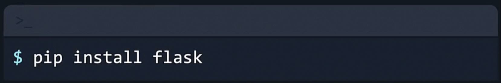

# 12-factor-app

The Twelve factor app is a methodology for building software-as-a-service apps that :

- Use declarative formats
- Have a clean contract with the underlying operating system
- Is suitable for deployment on modern cloud platforms
- Minimize divergence
- Can scale up


Since we have a flask app the first thing we should do is install flask

```bash
pip install flask
```

to upgrade pip you can run

```bash
pip install --upgrade pip
```



For our Dockerfile

```bash
FROM python:3.10-alpine # creates a image from the python base image 

WORKDIR /12-factor-app # sets the right working directory 

COPY requirements.txt . # copies the requirements.txt to the working directory 

RUN pip install -r requirements.txt --no-cache-dir # installs the dependencies 

COPY . /12-factor-app/ # copies the application code into the image 

CMD python app.py # defines the command to run the application using the CMD instruction 
```

running the docker build command we build an image

```bash
docker build . . .
```

and by running the docker run command we run one instance of our application

```bash
docker run . . .
```

- I Codebase : You should have one codebase

- II Dependencies : Explicitly declare and isolate dependencies
A 12 factor app never relies on implicit existence of system-wide packages

- III Config : Store config in the environment

- IV Backing Services : Backing services to treat Backing services as attached resources

- V Build, Release, Run : Strictly separate build and run stages

- VI Processes : To execute the app as one or more stateless processes

- VII Port Binding : Export services by Port Bindning

- VIII Concurrency : To scale out by the app process model

- IX Disposability : Maximize robustness with fast start up and graceful shutdown

- X Dev/Prod Parity : Keep development, staging and, production as similar as possible

- XI Logs : Treat logs as event streams

- XII Admin Processes : Run Admin or management task as one off processes
